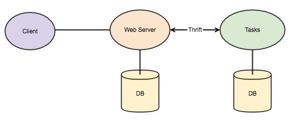

#Thrift Demo
In this repository you will find a simple example on how to make processes intercommunication using [Apache Thrift][apache-thrift] to build a simple [microservices architecture][microservices-arch]


##Contents
This is a very simple Task application.
  
**Clients** connect directly with the **Web Server** which deals with authentication, data validation, etc.

The **Web Server** connects with the **Tasks** service using Thrift to fetch and submit data

**Note:** Please refer to [Routes](ROUTES.md) for the basic Routing of the Web Server

##Prerequisites
To successfully run this demo please install the following dependencies:

  - [Thrift (0.9.3)][apache-thrift]
  - [MongoDB (3.2.4)][mongo-db]
  - [Node.js (4.3.1)][node-js]
  - npm (2.14.12) (installed with Node.js)
  - [Python (2.7.10)][python-org]
	- [pip][pip]
  	- [virtualenv][virtualenv]

###Thrift installation tip
For a simpler installation process of [Thrift][apache-thrift] in a OSX environment the following [Homebrew][homebrew] formula can be used:

```
$ brew install thrift
```

###Install
After installing all the dependencies execute the following in a terminal application/emulator:

```
$ cd /path/to/demo
```
Install all node.js server dependencies

```
$ cd /server && npm install
```
Create virtual environment for python with **$ENV** name and activate it

```
$ cd ../tasks 
$ virtualenv $ENV
$ . $ENV/bin/activate
```

Install Python dependencies

```
$ pip install -r requirements.txt
```

###Configuration
Please refer to the **config.json** file to change the configuration of your services

###Run
####MongoDB:
Make sure you have an instance of MongoDB running and that it is accessible

To start MongoDB using a **$MONGO_FOLDER** as Database file folder

```
$ mongod --dbpath $MONGO_FOLDER
```

####Webserver:
From the base folder type the following:

```
$ node server/.
```

####Tasks Service:
Activate the virtual environment and from the base folder type the following:

```
$ python newserver.py
```
This will run the python Thrift server using **thriftpy** library.

##Thrift files
###demo.thrift
In this file we are importing the other two thrift files and will generate the Thrift classes for **Webserver**

###tasks.thrift
This file describes the Tasks service and struct

###Generating the thrift classes
If you want to change the thrift files and update the services accordinly follow the steps below:
####Webserver
From the base folder in the terminal application:

  1. Build the new files. This command will generate the classes and services for Node.js in a ``gen-nodejs`` folder

   ```
   $ thrift -r --gen js:node demo.thrift
   ```
  2. Remove the current generated files from the server folder ```server/server/gen-nodejs/```

   ```
   $ rm -r server/server/gen-nodejs
   ```
  3. Move the newly generated files to the ```server/server``` folder
   
   ```
   $ mv gen-nodejs server/server
   ```
 
####Tasks service
As the tasks service will only deal with ``Tasks`` we can build only the necessary classes for it.
From the base folder in the terminal application: 

  1. Build the new files. This command will generate the classes and services for Python in a ``gen-py`` folder

   ```
   $ thrift -r --gen py tasks.thrift
   ```
  2. Remove the current generated files from the server folder ```tasks/gen-py/```

   ```
   $ rm -r tasks/gen-py
   ```
  3. Move the newly generated files to the ```tasks``` folder
   
   ```
   $ mv gen-py tasks
   ```

##Webserver (server folder)
* Node.js webserver using Express 4.x
* Serves the client interface
* Deals with authentication and authorization
* Works as a proxy between the clients and the other services


##Tasks Service (tasks folder)
* Python Thrift server
* Manages changes to Tasks data

##TODO
- [ ] Create web user interface
- [ ] Publish Services using docker
- [ ] Create unit tests for each service
- [ ] Add Report microservice 


####[LICENSE](LICENSE.MD)

**This demo was built and tested using the following environment:**  
MacBook Pro (Retina, 13-inch, Late 2013)  
**Processor:** 2.4 GHz Intel Core i5  
**Memory:** 8 GB 1600 MHz DDR3  
**OS:** OSX 10.10.5


[mongo-db]: https://www.mongodb.org/downloads#production
[node-js]: https://nodejs.org/
[python-org]: https://www.python.org/
[apache-thrift]: thrift.apache.org
[microservices-arch]: http://microservices.io/patterns/microservices.html
[pip]: https://pypi.python.org/pypi/pip
[virtualenv]: https://pypi.python.org/pypi/virtualenv
[pymongo]: https://pypi.python.org/pypi/pymongo
[thriftpy]: https://github.com/eleme/thriftpy
[homebrew]: http://brew.sh/